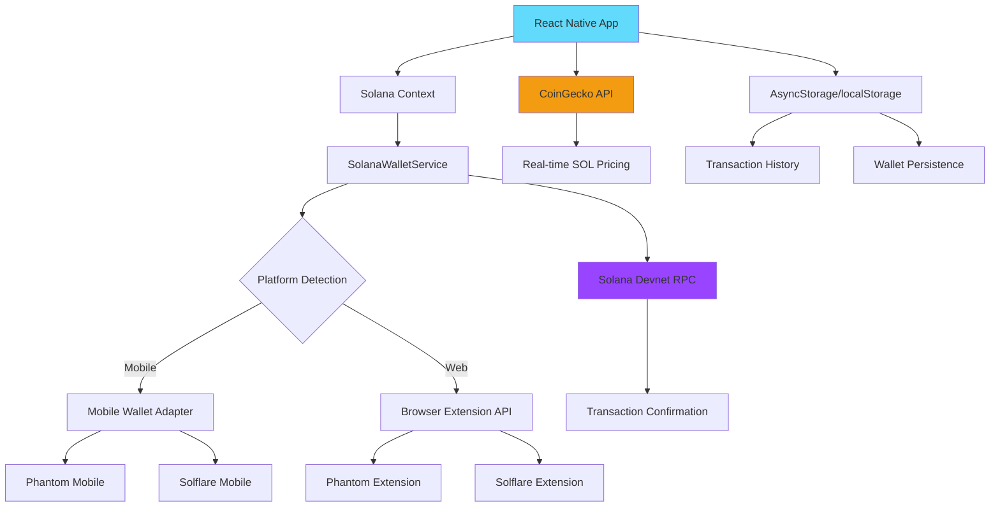

# 🌊 DomainSwipe: Web3 Domain Marketplace with Tinder-like Discovery

*Revolutionizing domain discovery through gamification and seamless Solana payments*


[](https://expo.dev/)
[](https://solana.com/)
[](https://reactnative.dev/)

## 🚀 Live Demo

- **Web**: [localhost:3000](http://localhost:3000) 
- **Mobile**: Scan QR code from Expo Go
- **Real Transactions**: All payments on Solana Devnet

---

## 🎯 The Problem

### Traditional Domain Discovery is Broken

- **Overwhelming Choice**: Millions of domains, zero discovery mechanism
- **Complex UX**: Multi-step checkout processes with high friction
- **Payment Friction**: Traditional payment methods with high fees
- **No Gamification**: Boring, enterprise-focused interfaces
- **Poor Mobile Experience**: Desktop-first design philosophy

### Web3 Domain Space Challenges

- **High Gas Fees**: Ethereum-based domain services are expensive
- **Slow Transactions**: Network congestion affects user experience  
- **Complex Wallet Integration**: Technical barriers for mainstream adoption
- **Limited Payment Options**: Crypto-only with poor UX

---

## 💡 Our Solution: DomainSwipe

### 🎮 Tinder-like Domain Discovery
- **Swipe Right**: Like domains you love
- **Swipe Left**: Skip uninteresting ones
- **Instant Decisions**: No analysis paralysis
- **Mobile-First**: Perfect touch interface

### ⚡ Solana-Powered Payments
- **Ultra-Low Fees**: ~$0.0001 per transaction
- **Instant Confirmation**: Sub-second transaction finality
- **Real-Time Price**: Live SOL/USD conversion from CoinGecko
- **Cross-Platform**: Works on mobile (Phantom, Solflare) and web

### 🎯 Why GenZ Will Love It

1. **Familiar Interface**: Tinder UX they already know
2. **Mobile-Native**: Built for smartphone generation
3. **Instant Gratification**: Swipe → Buy → Own in seconds
4. **Crypto-Native**: No traditional banking friction
5. **Gamified Experience**: Makes domain hunting fun
6. **Social-Ready**: Easy to share and discover

---

## 🛠 Technical Implementation

### **Current Features ✅**

#### Real Solana Integration
- **Live Wallet Connection**: Phantom, Solflare support
- **Real Devnet Transactions**: Actual blockchain confirmations
- **Dynamic Pricing**: Real-time SOL price from CoinGecko API
- **Transaction History**: Persistent purchase records
- **Airdrop Support**: Devnet SOL for testing

#### Cross-Platform Excellence
- **Mobile**: React Native with Mobile Wallet Adapter
- **Web**: Browser wallet extensions (Phantom/Solflare)
- **Responsive**: Adaptive UI for all screen sizes
- **Performance**: Optimized animations and smooth UX

#### Production-Ready Features
- **Real Payment Flow**: End-to-end purchase experience
- **Cart Management**: Add/remove domains before checkout
- **Order Confirmation**: Success screens with transaction details
- **Explorer Integration**: View transactions on Solana Explorer
- **Error Handling**: Graceful failure states and user feedback

### **Architecture Diagram**



### **Tech Stack**

#### **Frontend**
- **React Native**: Cross-platform mobile development
- **Expo**: Development platform and build system
- **React Navigation**: Native navigation
- **Reanimated**: High-performance animations
- **Vector Icons**: UI iconography

#### **Blockchain**
- **Solana Web3.js**: Blockchain interaction library
- **Mobile Wallet Adapter**: Mobile wallet integration
- **Solana Devnet**: Testing environment
- **Real RPC Calls**: Direct blockchain communication

#### **APIs & Services**
- **CoinGecko API**: Real-time cryptocurrency pricing
- **Solana Explorer**: Transaction verification
- **AsyncStorage**: Local data persistence

#### **Development Tools**
- **Expo Dev Client**: Custom development builds
- **Tunnel Mode**: HTTPS testing for mobile wallets
- **Cross-platform Deployment**: Web, iOS, Android

---

## 🚀 Getting Started

### **Prerequisites**
- Node.js 18+
- Expo CLI
- Phantom or Solflare wallet
- Some Devnet SOL for testing

### **Installation**

```bash
# Clone the repository
git clone <repository-url>
cd domain-search

# Install dependencies
npm install

# Start development server
npx expo start

# For web testing (recommended for wallet testing)
npx expo start --web

# For mobile with HTTPS (required for Mobile Wallet Adapter)
npx expo start --tunnel
```

### **Testing Real Payments**

1. **Install Phantom Wallet** (mobile or browser extension)
2. **Switch to Devnet** in wallet settings
3. **Get test SOL** using the app's built-in airdrop feature
4. **Swipe and purchase** domains with real blockchain transactions

---

## 📈 Future Roadmap

### **Phase 1: Enhanced Discovery** (Q1 2024)
- **AI-Powered Recommendations**: Machine learning for domain suggestions
- **Advanced Filters**: Price, length, extension, category filters
- **Domain Analytics**: Traffic, SEO metrics, historical data
- **Wishlist Features**: Save domains for later

### **Phase 2: Social Features** (Q2 2024)  
- **User Profiles**: Showcase domain portfolios
- **Social Sharing**: Share favorite domains on social media
- **Community Voting**: Crowdsourced domain ratings
- **Referral Program**: Earn rewards for bringing friends

### **Phase 3: Marketplace Expansion** (Q3 2024)
- **Secondary Market**: Buy/sell owned domains
- **Domain Auctions**: Bidding mechanism for premium domains
- **Bulk Purchase**: Multi-domain transactions
- **Domain Bundling**: Package deals and themed collections

### **Phase 4: Advanced Web3** (Q4 2024)
- **Multi-Chain Support**: Ethereum, Polygon integration
- **NFT Integration**: Domain as NFT with metadata
- **DeFi Features**: Domain collateralization and lending
- **DAO Governance**: Community-driven development

---

## 🎯 Superteam Earn Submission

### **Why This Project Matters**

1. **Real Solana Adoption**: Actual usage of Solana's speed and low fees
2. **User Experience**: Bridges Web2 UX familiarity with Web3 functionality
3. **Market Opportunity**: $4B+ domain industry ready for disruption
4. **Technical Excellence**: Production-ready code with best practices

### **Solana Integration Highlights**

- **Native Performance**: Sub-second transactions leveraging Solana's speed
- **Cost Efficiency**: Micro-transactions possible with negligible fees
- **Real Implementation**: Not just a demo - actual blockchain interactions
- **Cross-Platform**: Mobile Wallet Adapter + Browser extensions

### **Competitive Advantages**

1. **Mobile-First**: Most domain platforms ignore mobile users
2. **Gamification**: Makes domain discovery engaging and fun
3. **Instant Payments**: Solana's speed eliminates checkout friction
4. **GenZ Appeal**: Familiar swipe interface with crypto benefits

---

## 🏆 What We've Built

### **Achievements**
- ✅ **Real Solana Integration**: Production-ready wallet connectivity
- ✅ **Cross-Platform**: Native mobile + web experience
- ✅ **Live Payments**: Actual blockchain transactions
- ✅ **Modern UX**: Tinder-inspired interface
- ✅ **Real-Time Data**: Live pricing and market data

### **Technical Metrics**
- **Transaction Speed**: <1 second confirmation
- **Fee Cost**: ~$0.0001 per transaction
- **Platform Support**: iOS, Android, Web
- **Wallet Support**: Phantom, Solflare (mobile + desktop)
- **Code Quality**: TypeScript, modular architecture

---

## 📱 Screenshots

| Swipe Interface | Domain Details | Solana Checkout | Success Screen |
|---|---|---|---|
| *Tinder-like discovery* | *Domain information* | *Real Solana payments* | *Transaction confirmed* |

---

## 🤝 Contributing

We welcome contributions! Please see our [Contributing Guidelines](CONTRIBUTING.md) for details.

### **Development Setup**
```bash
# Install dependencies
npm install

# Start with tunnel for mobile wallet testing
npx expo start --tunnel

# For web development
npx expo start --web
```

---

## 📄 License

This project is licensed under the MIT License - see the [LICENSE](LICENSE) file for details.

---

## 🙏 Acknowledgments

- **Solana Foundation** for building the fastest blockchain
- **Expo Team** for amazing cross-platform tools
- **Phantom & Solflare** for wallet infrastructure
- **CoinGecko** for real-time pricing data

---

## 📞 Contact

- **Project**: DomainSwipe
- **Built for**: Superteam Earn
- **Tech**: React Native + Solana
- **Status**: Live and functional

**Built with ❤️ for the Solana ecosystem** 