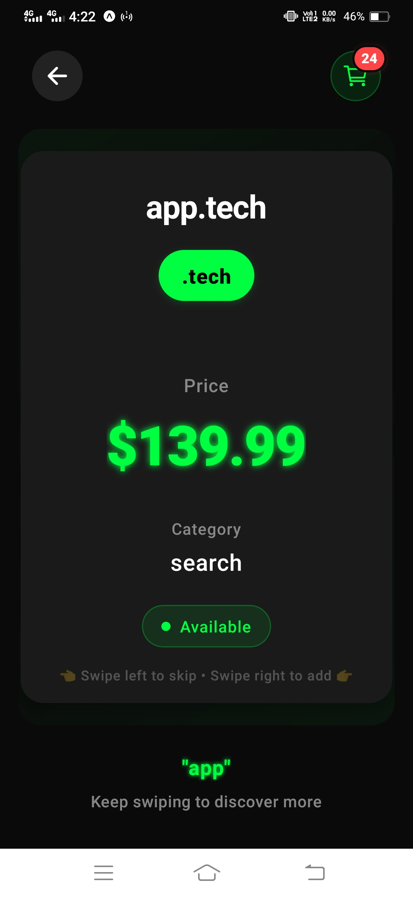
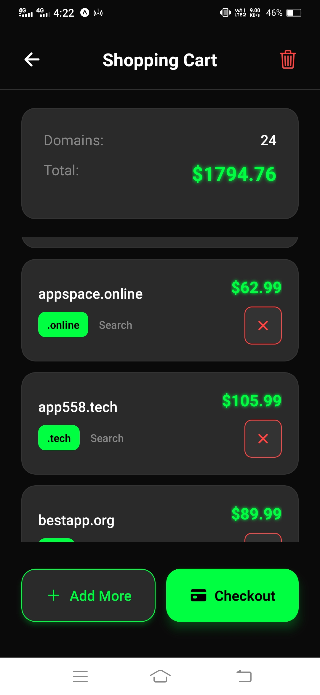
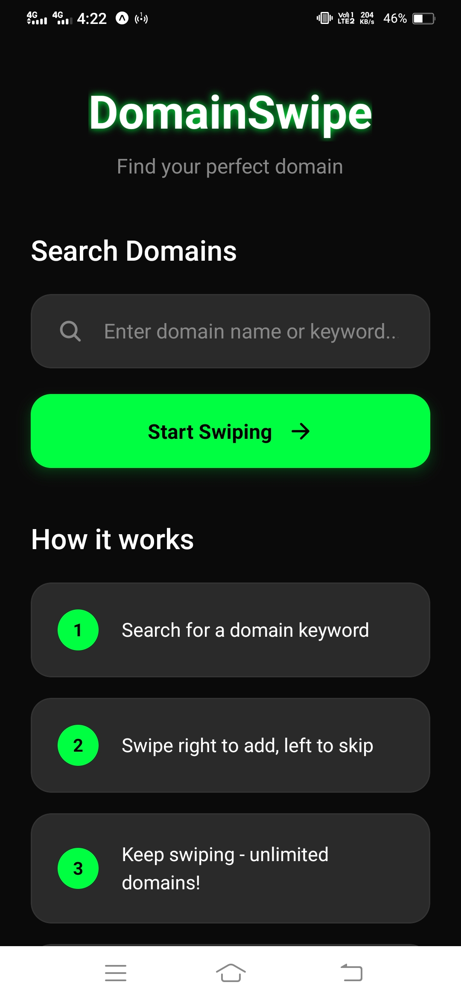
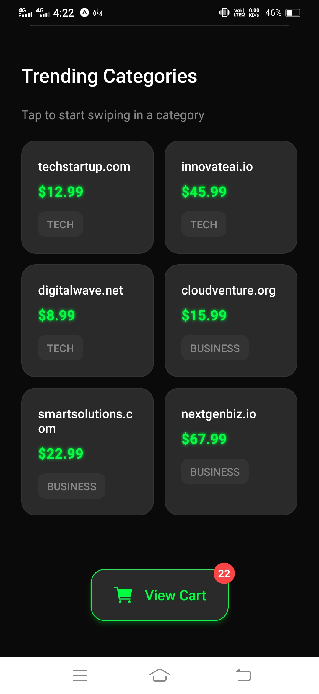
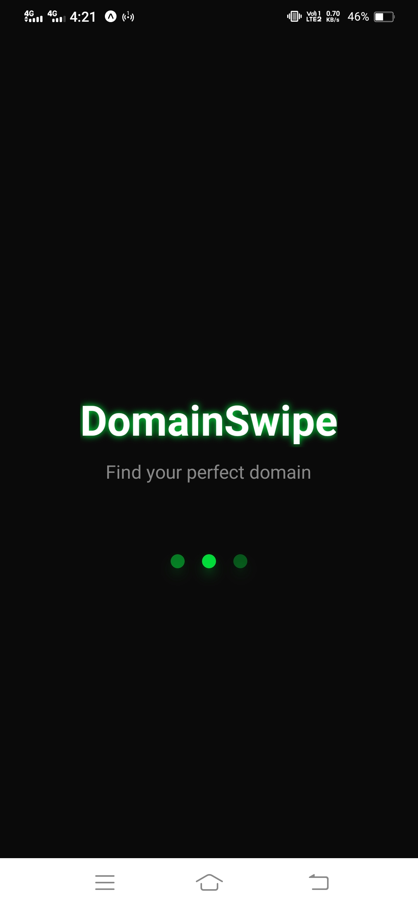

# DomainSwipe 🚀
*Tinder for Domains - A Solana-Powered Domain Marketplace*

<div align="center">
  
  
  <br><br>
  
  <video width="600" controls>
    <source src="./assets/video.mp4" type="video/mp4">
    Your browser does not support the video tag.
  </video>
  
  *Demo video showcasing the complete DomainSwipe experience*
</div>

## 🎯 The Problem

Domain hunting is broken. Currently, finding the perfect domain involves:
- Manually searching through endless domain registrars
- Checking availability one by one across multiple platforms
- Getting overwhelmed by thousands of options
- Missing out on great alternatives when your first choice is taken
- Complex pricing across different registrars with hidden fees

As someone who's struggled with finding domains for multiple projects, I realized that domain discovery needed the same innovation that transformed how we discover everything else - from partners (Tinder) to properties (Airbnb).

## 💡 What We're Building

DomainSwipe is the first **gamified domain discovery platform** built on Solana. Think Tinder, but for domains. Users swipe through curated, available domains tailored to their keywords and preferences. When they find domains they love, they can purchase them instantly using SOL.

**Key Features:**
- 🎮 **Swipe-based Discovery**: Intuitive Tinder-like interface for domain browsing
- ⚡ **Real-time Availability**: Live domain availability checking across major registrars
- 💰 **Solana Payments**: Instant purchases using SOL cryptocurrency
- 🎯 **Smart Recommendations**: AI-powered suggestions based on user preferences
- 📱 **Mobile-First**: Optimized for mobile users (primary target for adoption)
- 🔗 **Multi-registrar Integration**: Connects with GoDaddy, Namecheap, and other major platforms

## 🛠️ How We're Doing It

### Technical Architecture
```
Frontend: React Native (Expo) - Cross-platform mobile & web
Blockchain: Solana Devnet (moving to Mainnet)
Wallet Integration: Phantom, Solflare, Mobile Wallet Adapter
Domain APIs: GoDaddy, Namecheap, Domain.com APIs
Payment Processing: Solana blockchain transactions
Storage: AsyncStorage (mobile), LocalStorage (web)
```

### User Flow
1. **Keyword Input**: User enters business/project keywords
2. **Smart Generation**: Our algorithm generates relevant domain suggestions
3. **Swipe Discovery**: Users swipe through domains (left to skip, right to save)
4. **Cart Management**: Saved domains go to shopping cart
5. **Solana Payment**: Users pay instantly with SOL
6. **Domain Registration**: We handle registration with the respective registrar

### Current Demo Status
I've built a fully functional web demo showcasing all core features. The mobile version requires an EAS (Expo Application Services) premium subscription ($99/month) which I currently cannot afford as a solo developer. This grant would enable me to:
- Deploy the mobile app to app stores
- Access proper mobile wallet integration
- Scale the infrastructure for user growth

## 📱 Screenshots

<div align="center">
  
  
  
  
  
</div>

*Screenshots showcasing the complete user journey from domain search to Solana payment*

## 🏗️ System Architecture

### High-Level Architecture
```
┌─────────────────┐    ┌─────────────────┐    ┌─────────────────┐
│   Mobile App    │    │    Web App      │    │   Admin Panel   │
│  (React Native) │    │ (React Native   │    │   (Future)      │
│                 │    │      Web)       │    │                 │
└─────────────────┘    └─────────────────┘    └─────────────────┘
         │                       │                       │
         │                       │                       │
         └───────────────────────┼───────────────────────┘
                                 │
                    ┌─────────────────┐
                    │  Frontend Layer │
                    │   (React Native │
                    │    + Expo)      │
                    └─────────────────┘
                                 │
                    ┌─────────────────┐
                    │  State Management│
                    │   - CartContext  │
                    │   - SolanaContext│
                    └─────────────────┘
                                 │
         ┌───────────────────────┼───────────────────────┐
         │                       │                       │
┌─────────────────┐    ┌─────────────────┐    ┌─────────────────┐
│  Wallet Layer   │    │  Domain Layer   │    │ Blockchain Layer│
│                 │    │                 │    │                 │
│ • Phantom       │    │ • GoDaddy API   │    │ • Solana Devnet │
│ • Solflare      │    │ • Namecheap API │    │ • Smart Contract│
│ • Mobile Wallet │    │ • Domain.com    │    │ • SOL Payments  │
│   Adapter       │    │ • Real-time     │    │ • Transaction   │
│                 │    │   Availability  │    │   History       │
└─────────────────┘    └─────────────────┘    └─────────────────┘
         │                       │                       │
         │                       │                       │
         └───────────────────────┼───────────────────────┘
                                 │
                    ┌─────────────────┐
                    │   Data Layer    │
                    │                 │
                    │ • AsyncStorage  │
                    │ • LocalStorage  │
                    │ • Transaction   │
                    │   History       │
                    └─────────────────┘
```

### Payment Flow Architecture
```
User Wallet                 DomainSwipe                 Registrar
┌─────────┐                ┌─────────────┐              ┌─────────┐
│ Phantom │                │             │              │ GoDaddy │
│ Solflare│                │    App      │              │Namecheap│
│   etc.  │                │             │              │  etc.   │
└─────────┘                └─────────────┘              └─────────┘
     │                            │                           │
     │ 1. Connect Wallet          │                           │
     ├─────────────────────────>  │                           │
     │                            │                           │
     │ 2. Domain Selection        │                           │
     │    (Swipe Right)           │                           │
     ├─────────────────────────>  │                           │
     │                            │                           │
     │                            │ 3. Check Availability     │
     │                            ├─────────────────────────> │
     │                            │                           │
     │                            │ 4. Price Confirmation     │
     │                            │ <───────────────────────── │
     │                            │                           │
     │ 5. Payment Request         │                           │
     │    (SOL Amount)            │                           │
     │ <────────────────────────  │                           │
     │                            │                           │
     │ 6. Sign Transaction        │                           │
     ├─────────────────────────>  │                           │
     │                            │                           │
     │                            │ 7. Process Registration   │
     │                            │    (API Call)             │
     │                            ├─────────────────────────> │
     │                            │                           │
     │                            │ 8. Domain Registered      │
     │                            │ <───────────────────────── │
     │                            │                           │
     │ 9. Confirmation            │                           │
     │ <────────────────────────  │                           │
```

### Data Flow
```
1. User Input (Keywords) 
   ↓
2. Domain Generation Algorithm
   ↓
3. Real-time Availability Check (Multiple APIs)
   ↓
4. Pricing Aggregation
   ↓
5. Swipe Interface Presentation
   ↓
6. Cart Management (Local Storage)
   ↓
7. Solana Payment Processing
   ↓
8. Domain Registration via APIs
   ↓
9. Transaction History Storage
```

## 💰 Business Model

### Revenue Streams
1. **Transaction Fees**: 2-5% fee on each domain purchase
2. **Premium Features**: Advanced filtering, bulk purchases, priority support
3. **Registrar Partnerships**: Revenue sharing with domain registrars
4. **Future Services**: Domain hosting, website builders, premium domains marketplace

### Payment Flow Implementation
When a user purchases domains:
1. User pays total amount in SOL to our smart contract
2. Smart contract automatically deducts our service fee (2-5%)
3. Remaining amount is forwarded to the domain registrar
4. Domain registration is processed through registrar APIs
5. User receives domain ownership confirmation

### Handling Existing Domains
- **Real-time Checking**: We verify domain availability before showing to users
- **Multiple Registrars**: If domain exists on GoDaddy, we check other registrars
- **Alternative Suggestions**: Our AI suggests similar available domains
- **Price Comparison**: Show best prices across different registrars

## 🌟 Why This Grant Will Help

### Immediate Impact ($5K-$10K)
- **Mobile App Launch**: Pay for EAS premium to deploy iOS/Android apps
- **Registrar API Costs**: Cover API costs for real-time domain checking
- **Marketing**: Reach initial 1,000+ users through targeted campaigns
- **Infrastructure**: Upgrade hosting for better performance

### Scaling Phase ($10K-$15K)
- **Smart Contract Development**: Build more sophisticated payment handling
- **Advanced Features**: Implement bulk purchasing, domain portfolios
- **Team Expansion**: Hire a designer for better UX
- **Partnership Integration**: Deep integration with major registrars

## 🎯 Target Market & Solana Adoption

### Primary Users
- **Startup Founders**: Need quick domain discovery for new ventures
- **Small Business Owners**: Looking for brandable domains
- **Crypto Natives**: Already comfortable with SOL payments
- **Mobile-First Users**: Prefer mobile apps over desktop websites

### Driving Solana Adoption
- **Onboarding New Users**: Many domain buyers aren't crypto users yet
- **Real-world Utility**: Practical use case beyond trading/DeFi
- **Mobile Experience**: Seamless mobile wallet integration
- **Low Fees**: Solana's low transaction costs perfect for small domain purchases

## 🚀 Future Vision

### Phase 1 (Next 3 months)
- Launch mobile apps on iOS/Android
- Reach 1,000+ active users
- Process $50K+ in domain sales

### Phase 2 (6 months)
- **Domain Hosting Platform**: Users can host websites directly
- **NFT Integration**: Domains as NFTs for trading/speculation
- **Advanced Analytics**: Domain value predictions, trend analysis

### Phase 3 (12 months)
- **Marketplace Expansion**: Secondary market for premium domains
- **International Expansion**: Support for country-specific domains
- **Enterprise Features**: Bulk domain management for agencies

## 🔧 Technical Stack

### Frontend
- React Native + Expo (Cross-platform development)
- React Navigation (App navigation)
- React Native Gesture Handler (Swipe gestures)

### Blockchain
- @solana/web3.js (Solana interactions)
- @solana-mobile/mobile-wallet-adapter (Mobile wallet integration)
- Phantom/Solflare Web Extensions (Browser wallet support)

### APIs & Services
- GoDaddy Domains API (Domain availability & registration)
- Namecheap API (Alternative registrar)
- CoinGecko API (Real-time SOL pricing)

### Storage & State
- AsyncStorage (Mobile data persistence)
- Context API (State management)

### Development
- Expo Dev Tools (Development environment)
- EAS Build (Production app builds)

## 🎮 Why Mobile-First Matters

Mobile users represent the fastest-growing segment in both crypto and e-commerce. By building a mobile-first domain marketplace, we're:
- **Reducing Friction**: Domain buying becomes as easy as ordering food
- **Reaching New Demographics**: Mobile-native users who avoid desktop apps
- **Improving Conversion**: Better UX leads to higher purchase rates
- **Building Habits**: Quick, engaging interactions create user retention

## 📈 Competitive Advantage

### What Makes Us Different
1. **Gamification**: First swipe-based domain discovery platform
2. **Solana Integration**: Fast, cheap transactions vs traditional payment methods
3. **Mobile Optimization**: Built for mobile-first users
4. **Real-time Data**: Live availability and pricing across multiple registrars
5. **Simplified UX**: Complex domain hunting made simple and fun

### Market Opportunity
- Domain industry: $4+ billion annually
- Growing mobile commerce adoption
- Increasing crypto payment acceptance
- Untapped mobile domain discovery market

## 🤝 Open Source Commitment

Following the grant guidelines, DomainSwipe will be open-sourced upon mainnet deployment. This enables:
- **Community Contributions**: Other developers can improve the platform
- **Ecosystem Growth**: Building blocks for other Solana projects
- **Transparency**: Open payment flows and smart contract logic
- **Innovation**: Others can build upon our domain discovery innovations

## 📞 Get Involved

Currently seeking:
- **Funding**: To launch mobile apps and scale infrastructure
- **Partnerships**: Domain registrars interested in crypto integration
- **Community**: Early users and feedback from the Solana ecosystem
- **Mentorship**: Guidance from experienced Solana builders

---

*This project represents the intersection of practical utility and crypto innovation. By making domain discovery fun and payments seamless through Solana, we're creating real value for users while driving mainstream crypto adoption.*

**Demo**: Web version available at localhost:8081 during development  
**Repository**: This GitHub repository  
**Target**: Mobile-first Solana domain marketplace
